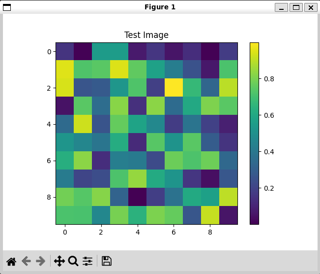
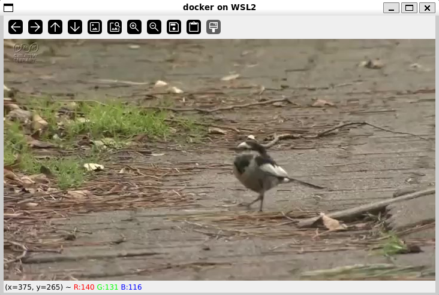

# show GUI in WSL2 Docker on Windows
sample code to show GUI in WSL2 Docker on Windows

## how to run
```bash
# build docker image
$ docker compose build

# run docker container
$ docker compose up -d
```

## result
After running the container, you can run the following commands to see the results. GUI will be displayed on Windows.

### matplotlib
```bash
$ python show_plot_matplotlib.py    
```



### cv2 img
```bash
$ python show_img_cv2.py
```



### cv2 video
```bash
$ python show_video_cv2.py
```


## versions
- Microsoft Windows 11 24H2
- Docker version 27.3.1, build ce12230
- Docker Compose version v2.29.7-desktop.1
- WSL version: 2.3.26.0
- kernel version: 5.15.167.4-1
- WSLg version: 1.0.65
- MSRDC version: 1.2.5620
- Direct3D version: 1.611.1-81528511
- DXCore version: 10.0.26100.1-240331-1435.ge-release
- Windows version: 10.0.26100.2605

## reference
- https://github.com/KurozumiGH/id-column-wslg/tree/main
- https://zenn.dev/nakurei/articles/display-graph-from-within-docker-container-on-wsl2
